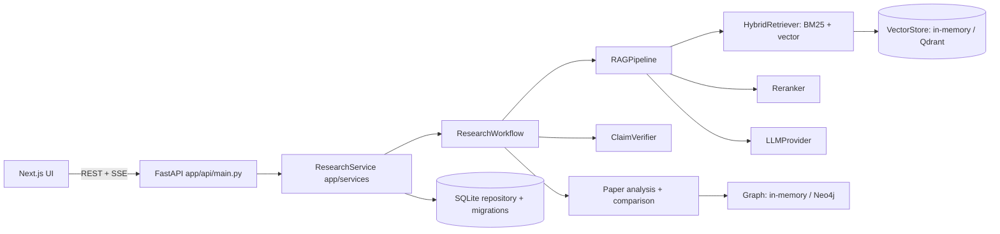

# Architecture

All endpoint behaviour lives in `app/services/research_service.py` (framework-free and unit-tested);
`app/api/main.py` only maps HTTP to service calls. Every component behind an interface
(`app/providers/base.py`, `VectorStore`, `GraphStore`, `ClaimVerifier`, `ResearchSource`) can be swapped by configuration.

**Implemented and tested:** everything except the boxes marked Qdrant / Neo4j / FastAPI / Next.js, which are written but unexecuted.
**Not implemented:** job queue (uploads index synchronously), Postgres repository (SQLite is used), Langfuse, workspaces.
